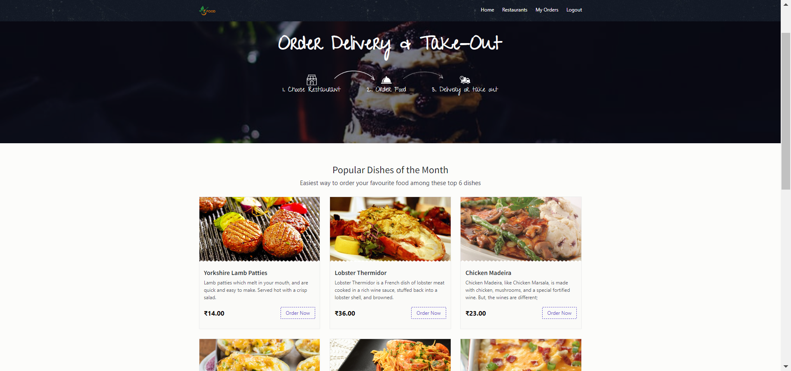
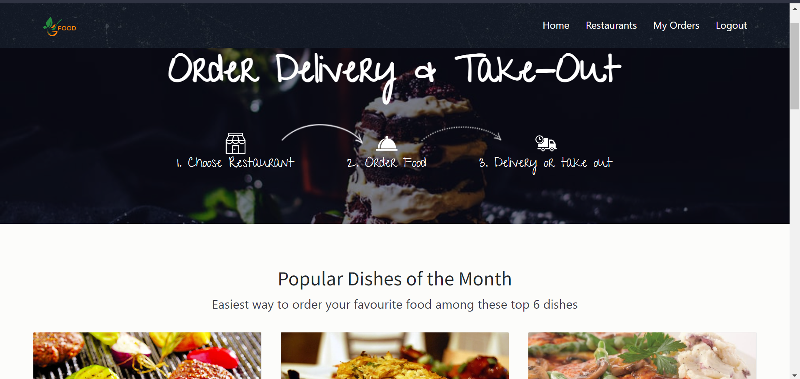
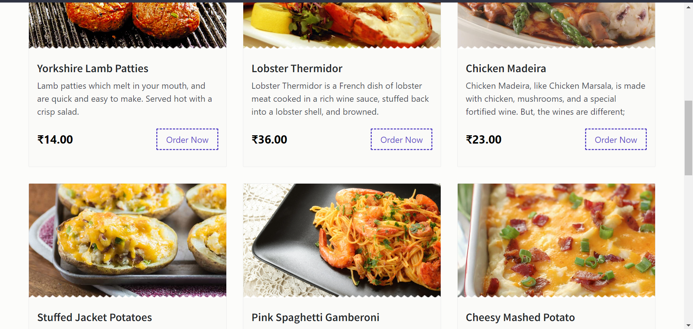
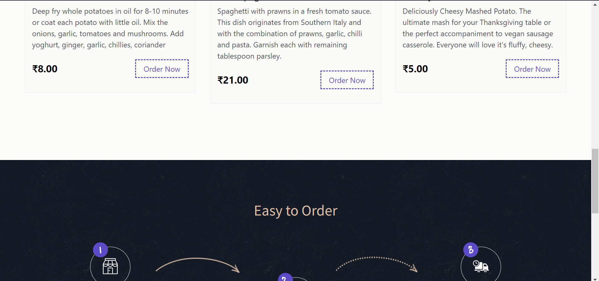
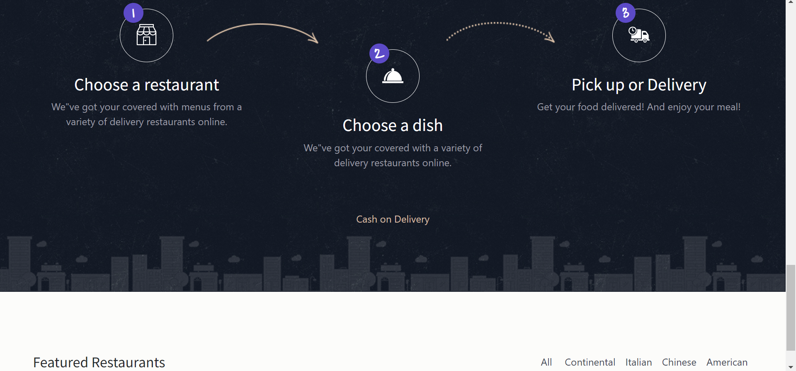
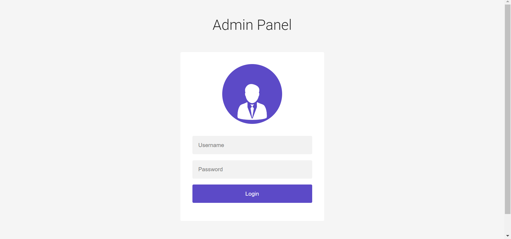
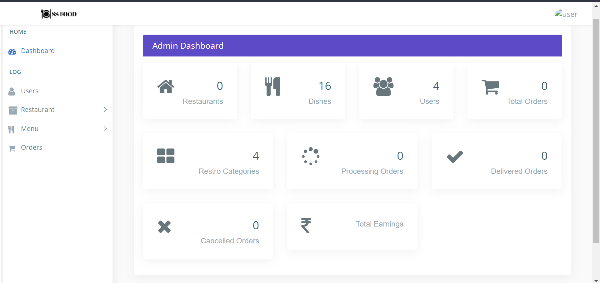
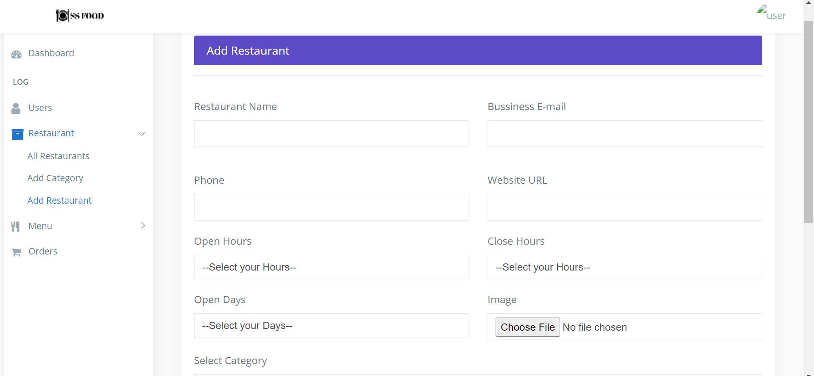
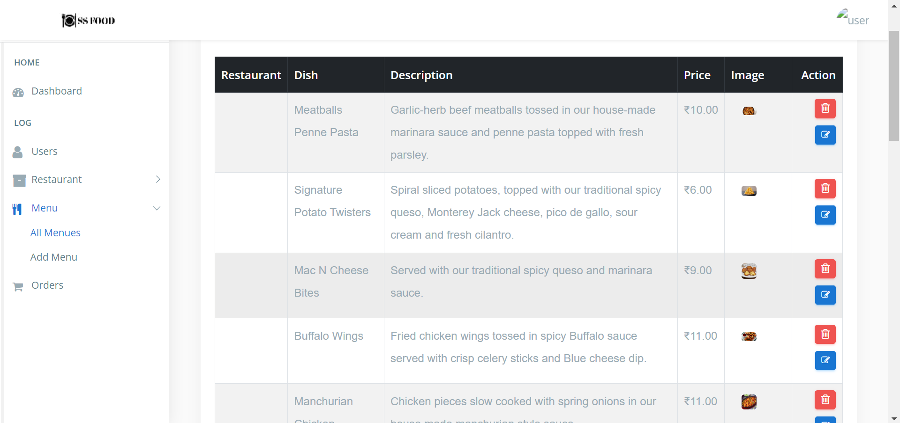

### Online-Food-Ordering-System

### Screenshorts

### Home Screen

### Order Booking

### admin login

### admin dashboard

### resturant add

### food add

### description

- Online Food ordering system is a process in which one can order various foods and beverages from some local restaurant and hotels through the use of internet, just by sitting at home or any place. And the order is delivered to the told location.

- The Online Food Order System In PHP is a simple project developed using PHP, JavaScript, and CSS. The project connects different restaurants with customers. The project contains an admin(manager) and the user side. All the management like editing site contents, updating food items, adding restaurants, and checking order status can be managed from the admin side. There can be many managers on the site.

- For the user section, the users can go through the homepage, about, and contact pages. In order to order the food items, the user has to create an account and sign in or log in. The food comes with the cost as well. This project makes a convenient way for customers to buy/purchase food online, without having to go to the restaurant.

- This Online Food Order System is in PHP, JavaScript, and CSS. Talking about the features of this system, it contains the admin(manager) section and the user (customer) section. All the editings, updating, managing order details, food items, and restaurants are from the admin section while customers can only go through the site and give orders if want. The design of this system is simple so that the user won’t get any difficulties while working on it.

- This is an Online ordering system written using PHP/MySQL.

### features:-
- order product online
- upload product design online
- add, edit, delete product
- send order confirmation via email
- manage online order
- Ajax hierarchical combobox for payment method.
- add delivery charge outside the coverage area
- secure reservation
- forum for customer comments about the site
- generates various report
- and many more

### install steps:-
1. Download zip file and Unzip file on your local server.
2. Put this file inside "c:/wamp/www/" .
3. Database Configuration
Open phpmyadmin
Create Database named onlinefood.
Import database food.sql from downloaded folder(inside database)
4. Open Your browser put inside "http://localhost/OnlineFood ordering system/"

Admin Login Details
- Login Id: huzaifkhan
- Password: huzaifkhan

  
